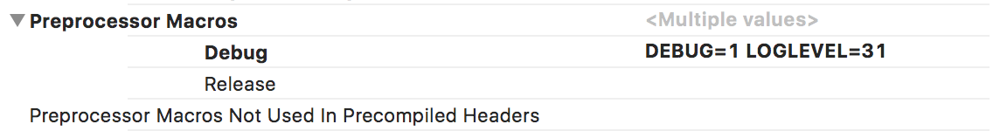
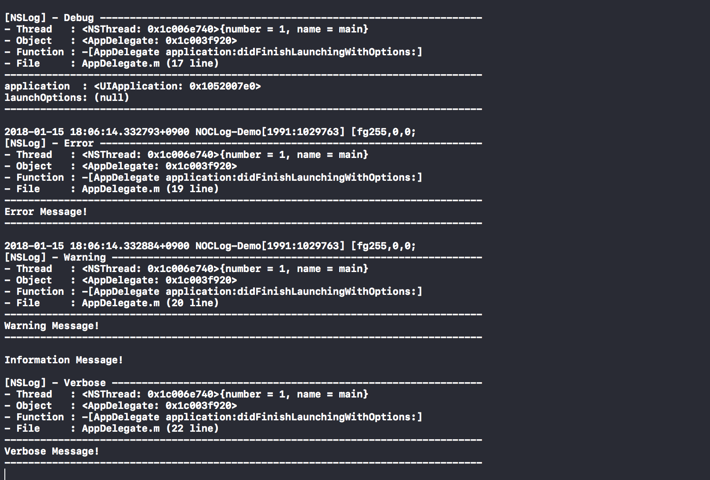

# NOCLog

[](https://travis-ci.org/a-snail/NOCLog)
[](http://cocoadocs.org/docsets/NOCLog)
[](http://cocoadocs.org/docsets/NOCLog)
[](http://cocoadocs.org/docsets/NOCLog)
[](http://twitter.com/snail_bok)

NOCLog is a very simple library that provides log output for debugging in Objective-C projects.

Xcode includes great debugging tools.
It mainly debugs using breakpoint and lldb, but sometimes debugging is done using console logs.

NOCLog is a very simple log output library, and you can use the log level to determine whether to outputs by log type.


## Installation

You can install it using [CocoaPods](https://cocoapods.org/), the project dependency management tool using Objective-C and Swift.

### Installation with CocoaPods
To inject a NOCLog dependency into your Xcode project using CocoaPods, add NOCLog in the Podfile.

```ruby
source 'https://github.com/CocoaPods/Specs.git'
platform :ios, '8.0'

target 'YourProjectName' do
pod 'NOCLog', '~> 0.1'
end
```

If you are already using a Podfile, you only need to add the NOCLog dependency.

```ruby
pod 'NOCLog', '~> 0.1'
```

If the NOCLog dependency is added to the Podfile, execute the following command.

```bash
$ pod install
```


## Usage

Whether to outputs the log is determined by log type(`NOCLogType`) and log level(`NOCLogLevel`).

### Set the log level
#### 1. Set the log level using macro definition
The log level can be specified using the `LOGLEVEL` macro definition.

```objective-c
#define LOGLEVEL 31
#import "NOCLog.h"
```

#### Notice
> The `LOGLEVEL` macro must be defined before importing the header file of the NOCLog library.
> Otherwise, it is set to the default value(`NOCLogLevelWarn` = 3).

#### 2. Set the log level using preprocessor macro
You can set the log level by specifying the `LOGLEVEL` value at the **Preprocessor Macro** in the **Project Setting** of the **Build Settings**.

```objective-c
LOGLEVEL=31
```



Using **Preprocessor Macros** is recommended because you can specify a separate log level for the Debug and Release environments.

### Available the log levels
| Log Level | NOCLogLevel | Explanation |
| ----: | :---- | :---- |
| `0` | `NOCLogLevelOff` | Outputs no logs. |
| `1` | `NOCLogLevelError` | Outputs only error logs. |
| `3` | `NOCLogLevelWarn` | Outputs error and warning logs. |
| `7` | `NOCLogLevelInfo` | Outputs error, warning and information logs. |
| `15` | `NOCLogLevelDebug` | Outputs error, warning, information and debug logs. |
| `31` | `NOCLogLevelVerbose` | Outputs all logs including detailed logs. |

### Log output macro functions
| Macro Functions | Log Type | Explanation |
| :---- | :---- | :---- |
| `NOCLogE` | `NOCLogTypeError` | Used for error log output. |
| `NOCLogW` | `NOCLogTypeWarn` | Used for warning log output. |
| `NOCLogI` | `NOCLogTypeInfo` | Used for information log output. |
| `NOCLogD` | `NOCLogTypeDebug` | Used for debug log output to understand execution flow. |
| `NOCLogV` | `NOCLogTypeVerbose` | Used for log output for more information. |


## Example

You can also refer to the demo app.

```objective-c
- (BOOL)application:(UIApplication *)application
  didFinishLaunchingWithOptions:(NSDictionary *)launchOptions {
    NOCLogD(@"%@%@\n%@%@",
            @"application  : ", application,
            @"launchOptions: ", launchOptions);

    NOCLogE(@"%@", @"Error Message!");
    NOCLogW(@"%@", @"Warning Message!");
    NOCLogI(@"%@", @"Information Message!");
    NOCLogV(@"%@", @"Verbose Message!");

    return YES;
}
```

If you add the log output code as above and run the app, it will be output to the console as below.



The above sample is when the log level(`LOGLEVEL`) is set to a value of 31 or more.

If the log level(`LOGLEVEL`) is not specified(default: `3`), only logs using `NOCLogE` and `NOCLogW` will be output to the console.


## License

NOCLog is released under the MIT license.
See [LICENSE](LICENSE) for details.
